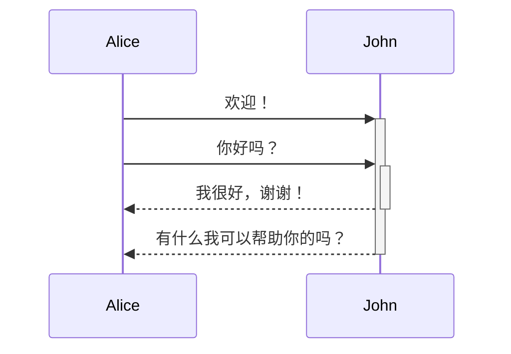
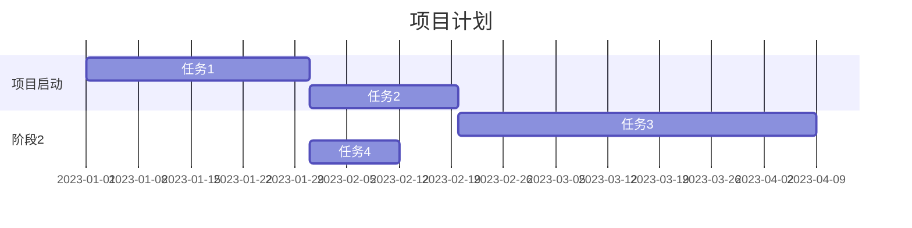
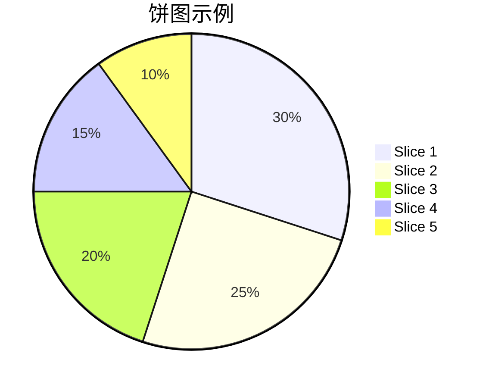
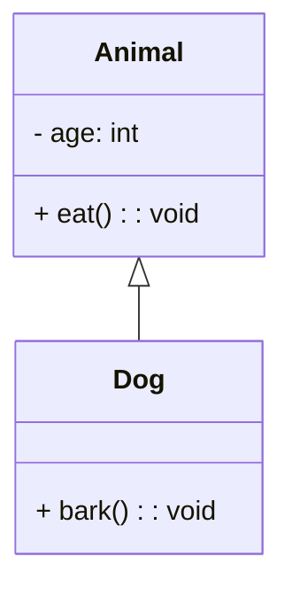

# Mermaid 教程

## 什么是 Mermaid

Mermaid 是一款文本驱动图表的工具，可以用简单的文本来描述来创建各种类型的图表，例如流程图、序列图、甘特图、饼图等。
Mermaid 可以作为一个 JavaScript 库使用，也可以作为一个命令行工具使用。
使用 Mermaid，可以轻松地在文本编辑器中编写图表定义，而无需使用专业的图表工具或图形用户界面。

## 如何使用 Mermaid

- 在 HTML 或 Markdown 文件中引用 Mermaid 库和 Mermaid CSS 样式表。
- 使用 Mermaid 的 CLI 工具在命令行中生成图表，或使用 Mermaid 的 API 在自己的应用程序中生成图表

以下是一些简单的 Mermaid 实例：

1. 流程图

```
graph TD;
  A-->B;
  A-->C;
  B-->D;
  C-->D;
```


2. 序列图

```
sequenceDiagram
  Alice->>+John: 欢迎！
  Alice->>+John: 你好吗？
  John-->>-Alice: 我很好，谢谢！
  John-->>-Alice: 有什么我可以帮助你的吗？
```



3. 甘特图

```
gantt
  title 项目计划
  section 项目启动
    任务1           :a1, 2023-01-01, 30d
    任务2           :after a1  , 20d
  section 阶段2
    任务3           : 48d
    任务4           :after a1  , 12d
```



4. 饼图

```
pie
  title 饼图示例
  "Slice 1" : 30
  "Slice 2" : 25
  "Slice 3" : 20
  "Slice 4" : 15
  "Slice 5" : 10
```



5. 类图

```
classDiagram
  class Animal {
    - age: int
    + eat(): void
  }
  class Dog {
    + bark(): void
  }
  Animal <|-- Dog
```



注意：要在 vitepress 中集成 Mermaid 图表，需要安装`vitepress-plugin-mermaid`和`mermaid`插件，以及在 `.vitepress/config.js` 中进行配置。

```bash
npm install vitepress-plugin-mermaid mermaid -D
```

```js
// .vitepress/config.js
import { defineConfig } from "vitepress";
import { withMermaid } from "vitepress-plugin-mermaid";

export default withMermaid(
  defineConfig({
    // your existing vitepress config...

    // optionally, you can pass MermaidConfig
    mermaid: {
      // ...
    },
  })
);
```

更多内容，推荐阅读 [Mermaid 官方文档](https://mermaid.js.org/)
