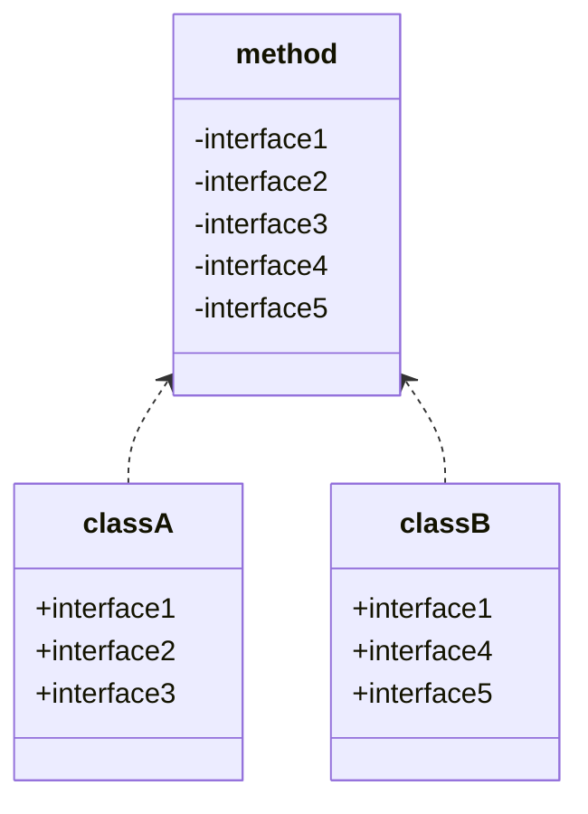
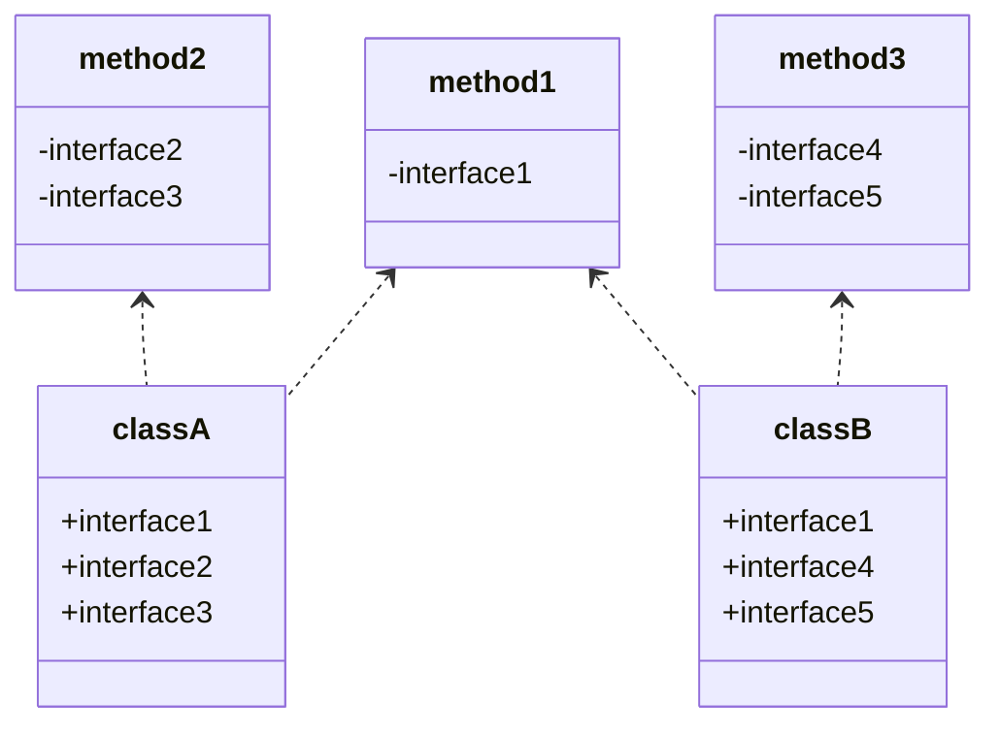
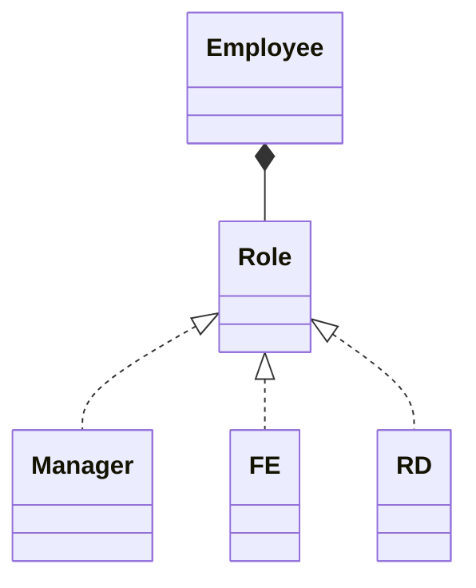

# 设计模式之七大基本原则

### 七大基本原则

在设计一些设计模式时，一版遵循以下七项基本原则：

1. 单一职责原则
2. 开放-关闭原则
3. 里氏替换原则
4. 依赖倒转原则
5. 接口隔离原则
6. 迪米特法则
7. 组合/聚合复用原则

## 单一职责原则 SRP

单一职责原则表示一个模块的组成元素之间的功能相关性，从软件开发的角度来看，就一个类而言应该自由一个让它变化的原因。通俗讲即一个类只负责一项职责。
假设某个类P负责两个不同职责，职责P1和职责P2，那么当职责P1需求发生改变而需要修改类P，有可能会导致原来运行正常的职责P2功能发生故障。

```js
// 假设场景：有一个动物类，它会呼吸空气
class Animal {
  breathe(animal) {
    console.log(animal + '呼吸空气');
  }
}
class Client {
  main() {
    const animal = new Animal();
    animal.breathe('牛');
    animal.breathe('羊');
  }
}

// 后来发现问题：并不是所有动物都靠空气呼吸，修改时如果遵循单一职责原则的话，需要将 Animal 类进行拆分为陆生类和水生动物类
class Terrestrial {
  breathe(animal) {
    consol.log(animal + '呼吸空气');
  }
}
class Aquatic {
  breathe(animal) {
    consol.log(animal + '呼吸水');
  }
}
class Client {
  main() {
    const terrestrial = new Terrestrial();
    terrestrial.breathe('牛');
    terrestrial.breathe('羊');
    const aquatic = new Aquatic();
    aquatic.breathe('鱼');
  }
}

// 实际工作中，这样修改的开销可能较大，除了要修改 Animal 类还要修改 Client 类。而如果直接修改 Animal 类来达到目的虽然违背了单一职责原则，但是花销却小了
class Animal {
  breathe(animal) {
    if (animal === ' 鱼') {
      console.log(animal + '呼吸水');
    } else {
      console.log(animal + '呼吸空气');
    }
  }
}
// 虽然这样修改简便了许多，但是却存在很多隐患，如果有一天需要加入某类动物不需要呼吸，那么就得行改 Animal 类的 breathe 方法，而对原有代码的修改kennel会对其他功能带来风险。
// 这种直接在代码级别修改的方式违背了单一职责原则，虽然修改起来简单，但是隐患很大

// 还有一种不修改原来代码的情况下，加入一个新的方法，这样虽然违背了单一职责原则，但是并没有修改原来的代码，不会对原来代码的功能造成影响
class {
  breathe(animal) {
    consol.log(animal + '呼吸空气');
  }

  breathe2(animal) {
    consol.log(animal + '呼吸水');
  }
}
```

总结：SRP 是一个简单直观的原则，但在实际编码过程中不好恰当的运用，需要结合实际情况进行使用，但不建议直接在代码级别中修改到原有功能的方式。
SRP 可以降低代码复杂度，一个类只负责一项职责，逻辑上肯定也比负责多项职责来的简单，提高了代码的可读性，提高系统的可维护性。

## 开放-关闭原则 OCP

开放-关闭原则表示类、模块、函数等应该是可以被扩展的，但是不可以被修改。
满足 OCP 原则将有两项优点：能够扩展已存在的系统，提供新的功能满足新的需求，有很强的适应性和灵活性。已存在的模块不需要被修改，有很强的稳定性和持久性。

```js
// 例如：一个生产电脑的公司，根据输入类型，生产出不同的电脑
interface Computer {}
class MacBook implements Computer {}
class Surface implements Computer {}
interface Factory {
  produceComputer() {}
}

class AppleFactory implements Factory {
  produceComputer() {
    return new Macbook();
  }
}
class SurfaceFactory implements Factory {
  produceComputer() {
    return new Surface();
  }
}

// 如果只有一个 Factory 类进行不同类型电脑的生产，在一个 produceComputer 方法里进行处理，违背了开放-关闭原则，如果需要添加新的电脑类型，就需要修改原有的代码。
```

总结：OCP 原则可以具有良好的扩展性和可维护性，不可能让一个系统的所有模块都满足该原则，能做到的是尽可能不要修改存量的代码，已有的功能，而是去扩展它。

## 里氏替换原则 LSP

会遇到这样的问题：一功能P1，由类A完成，现需要将功能P1进行扩展，扩展后的功能为P，其中P由原有功能P1和新功能P2组成。新功能P由类A的子类B完成，则子类B在完成新功能P2的同时，有可能会导致原有功能P1发生故障。
里氏替换原则的重点在不影响原功能，而不是不覆盖原方法。当使用继承时，类B继承类A时，除添加新的方法完成新增功能P2，尽量不要修改父类方法预期的行为。
继承包含一层含义：父类中凡是已经实现好的方法，实际上是在设定一系列的规范和契约，虽然不强制要求所有的子类必须遵从这些约定，但是如果子类对非抽象方法任意修改，就会对整个继承体系造成破坏。

```jsx
// A 类实线两数相减的功能
class A {
  func1(a, b) {
    return a - b;
  }
}
// 需要新增一个新的功能，完成两数相加，然后再与 100 求和。由类B实现
class B {
  func1(a, b) {
    return a + b;
  }
  func2(a, b) {
    return func1(a, b) + 100;
  }
}

// 这样会导致原本运行正常的相减功能发生错误，原因是类B的方法名func1重写了父类A的方法。
// 在实际编码过程中，常常会遇到通过重写父类方法来完成新的功能，这样写起来虽然简单，但是增加了风险
```

## 依赖倒转原则 DIP

依赖倒转原则的核心思想是面向接口编程。上层模块不应该依赖低层模块，二者应该于抽象，即抽象不应该依赖于细节，细节应该依赖于抽象。
例如一个需求需要操作数据库，负责封装数据库操作的和处理业务逻辑分别由不同同学编写，正确做法应该是处理业务逻辑的同学提供一个封装好的数据库操作的抽象接口，交给底层模块的同学去使用，这样降低耦合，双方互不影响。


```jsx
interface IReader {
  getContent() {}
}
class Newspaper implements IReader {
  getContent() {
    return '这是新闻';
  }
}
class Book implements IReader {
  getContent() {
    return '这是故事';
  }
}
class Mother {
  say(reader: IReader) {
    console.log('开始读书');
    console.log(reader.getContent());
  }
}
class Client {
  main() {
    Mother mother = new Mother();
    mother.say(new Book());
    mother.say(new Newspaper());
  }
}
```

## 接口隔离原则 ISP

接口隔离原则强调使用者不应该依赖他不需要的接口，一个类对另一个类的依赖应该建立在最小的接口上。



从上图可以看出类A和类B都存在用不到的方法，但由于实现了接口1，所以也一起实现了这些方法。如果接口定义过于臃肿，只要接口中出现的方法，不管依赖于它的类是否需要该方法，实现类都必须去实现这些方法，就不符合接口隔离原则。



如果要符合接口隔离原则，就必须对接口1进行拆分。
总结：接口隔离原则的思想在于建立单一接口，尽可能地去细化接口，接口中的方法尽可能少。但也需要有个度，如果接口设计过小则会造成接口数量过渡，使得设计复杂化。

## 迪米特法则 LOD

迪米特法则也称为最少知道原则，一个对象应该对其他对象有尽可能少的了解，不和陌生对象直接通信，而是通过中介对象来间接完成通信，以减少对象之间的依赖性，提高系统的灵活性和可维护性。每个对象都会与其他对象有耦合关系（依赖、关联、组合、聚合等），都尽量将逻辑封装在类的内部，对外提供公共方法。

```js
class Mediator {
  constructor() {
    this.colleagues = [];
  }
  addColleague(colleague) {
    this.colleagues.push(colleague);
  }
  distributeMessage(message, sender) {
    this.colleagues.forEach(colleague => {
      if (colleague !== sender) {
        colleague.receiveMessage(message);
      }
    });
  }
}

class Colleague {
  constructor(name, mediator) {
    this.name = name;
    this.mediator = mediator;
  }
  sendMessage(message) {
    this.mediator.distriuteMessage(message, this);
  }
  receiveMessage(message) {
    console.log(this.name, message);
  }
}

const mediator = new Mediator();
const colleague1 = new Colleague('colleague 1', mediator);
const colleague2 = new Colleague('colleague 2', mediator);
mediator.addColleague(colleague1);
mediator.addColleague(colleague2);
colleague1.sendMessage('i am colleague 1');
colleague2.sendMessage('i am colleague 2');
```

## 组合/聚合复用原则 CRP

组合/聚合复用原则就是在一个新的对象里面使用一些已有的对象，使之成为新对象的一部分；新的对象通过向这些对象的委派达到复用已有功能的目的。
在面向对象的设计中如果直接继承基类，会破坏封装，因为继承将基类的实现细节暴露给子类；如果基类的实现发生改变，则子类的实现也不得不改变；从基类继承而来的实现是静态的，不可能在运行时发生改变，没有足够的灵活性。于是就提出了组合/聚合复用原则。



总结：组合/聚合复用原则表达组合或者聚合好过于继承；聚合组合是一个黑箱复用，细节对象的内容对客户端来说不可见。
