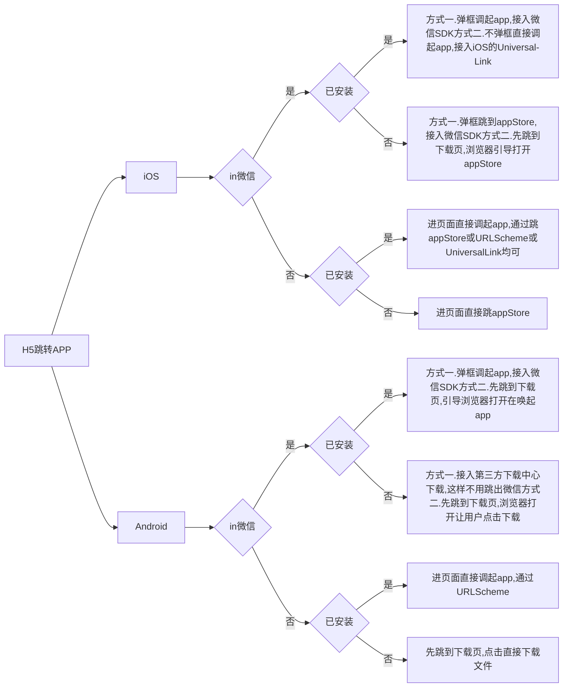

## Deep Link

Deep Link 就是一个链接的概念，指 APP 在处理特定的 url 时能够直接跳转到对应的内容页面或者触发特定的逻辑。平常打开一个网站页面就是一个普通链接，深度链接不过时更加复杂些。

- URI Scheme：Android/iOS 都支持
- Universal Link：iOS 9+
- App Links：Android 6+
- Chrome Intents：
- 应用开放标签SDK：应用自身提供的能力，Android/iOS 都支持

目前移动开发 Deep Link 领域仍处于碎片式混乱的局面，有很多问题都待解决。

## URI Schemes

URI 就是一个资源的统一标志符，既可以是定为负也可以是一个名称。URL、URN 都属于 URI。
例如：weixin:// | alipay:// | taobao:// | sinaweibo:// | mqq:// | zhihu:// | sms:// |

- URI: universal resource identifier
- URL: universal resource locator
- URN: universal resource name

如何区分 URL 和 URN ？

- URL 包含了找到资源的路径和名称，也就是当一个 URI 包含了一个访问机制或者网络位置的时候（e.g. http:// 或 ftp://），就是一个 URL。
- URN 就是一个独一无二的资源名称，是有 urn 开头（e.g. urn:oasis:names:specification:docbook:dtd:xml:4.1.2
）的一串 URI

所以，他们之间重要的区别在于它的开头，也就是 Scheme。

## URI Schemes

scheme 就是一个 url 的开头部分，例如熟悉的 http:// 就是一个 scheme。
URI Schemes 时实现 deep linking 的第一代解决方案。利用它可以在移动开发中实现从 web 页面或者别的 app 中唤起其他 app 的功能。但依然有很多限制：
- 当要被唤起的 app 没有安装时，这个链接就会出错
- 当注册有多个 scheme 相同时，没有办法区分
因此，iOS 和 Android 分别有了自己的解决方案，分别是 iOS 的 Universal Link，和 Android 的 APP Link。

其中，custom URL Scheme，iOS 在之前很长一段时间内用来实现 deep linking 以及 app 间通信的方法。在 iOS 中，所有传到 app 中的 url 都是一个 NSURL 对象，可以定义 url 的组成，NSURL 支持大多数的传统 url 组成规则。NSURL 类中还有能够返回 url 中的不同部分的方法。
对于业务逻辑较少的 app 来说，可以直接通过 url 的字符串来区分业务逻辑。不过对于相对复杂的业务逻辑，就需要引入路由 router 来分发请求。

### Universal Link

在 iOS 9 之后，推出了一个替代之前的 custom URL Schemes 的新概念就是 Universal Link。
通俗讲，就是用了这个 Universal Link 可以让网站或者 web view 中的内容在用户点击跳转或安装了 app 后，仍然能够直接在这个 app 中被找到。比如用户在网上点击了‘在 app 中浏览该商品’的链接，这个时候就可以通过 Universal Link 去唤起这个 app，同时直接定位到该商品页面。

它的实现机制与 Deep Link 相似，只不过它不只是定义一个 custom URL scheme，而是匹配了多个 web 页面到 app 中相应的位置，当用户打开某个匹配的页面时，iOS 会自动地将其重定向到 app 内。

Universal Link 的好处：
- 当已经安装了 app 时，不需要加载任何 web 页面，app 就会立即启动；当没有安装 app 时，就会默认地从浏览器中重定向到 App Store 中引导用户下载安装这个 app。
  之前的 custom URL scheme 是自定义的协议，因此在没有安装 app 的情况下是无法直接打开的。而 Universal Link 本身就是一个能够指向一个 web 页面或者 app 中的内容的标准的 web link，因此能够更好的兼容其他情况。
- Universal Links 是从服务器上查询是哪个 app 需要被打开，因此不存在 custom URL scheme 那样名字冲突、被抢占的情况。
- 安全性，用 Universal Link 去打开时，只有 app 开发者可以通过创建和上传一个允许神恶魔网页去通过这个 url 打开该 app 的文件。
- 隐私性，其他 app 并不能通过该方法检测此 app 是否被安装。

Universal Link 的缺陷：
- 基于下面机制，用户非常容易在选择过一种打开方式之后，使得唤醒 app 的功能失效了
  iOS 的 Universal Link 的一个机制：当用户点击了 Universal Link 之后，iOS 会去检测用户最近一次是选择了直接打开 app 还是打开网站。这个选择步骤实在用户进入 app 之后，顶部 bar 的右侧会出现一个按钮选项。因此，一旦用户点击了这个按钮选项，就会通过 Safari 打开网很赞，并且在之后的操作中，默认一致延续这个选项，除非用户从 webpage 上通过点击另一个选项来打开。

### Deferred Deep Link

无论是 URI Scheme 还是 Universal Link 都没有解决一个问题，就是如果设备上没有安装这个 app 时，保留住此时用户停留的上下文。
例如，使用 Universal Link 在没有安装 app 的情况下，iOS 能够重定向到 App Store 去引导用户下载安装 app，但是在安装以后，app 只能打开首页，也就是说丢失了用户在点击跳转进入 app 之前的那个页面。

因此，有了一个新的概念 Deferred Deep Link，可以理解为延迟一下，在安装过程中保留跳转前的特定页面内容，在 app 安装之后，在利用这个 link 在 app 里进行跳转。例如，用户在某个电商网站上点击了一个商品的按钮‘在 app 中查看该商品’，但他并没有安装这个 app，于是 iOS 就引导到 App Store 安装这个 app，当安装完成后，打开这个 app，就会自动地在 app 中跳转到他刚才想看的那个商品的页面。

### App Links

Android 6.0 引入的新功能，基于 Deep Linking，允许应用自动处理网站的 url，而无需提示用户启动应用。例如在浏览器输入某个 url，而应用支持该 url 进行启动，那么系统会直接打开应用，而不是浏览器打开网站的页面。

### 举例

